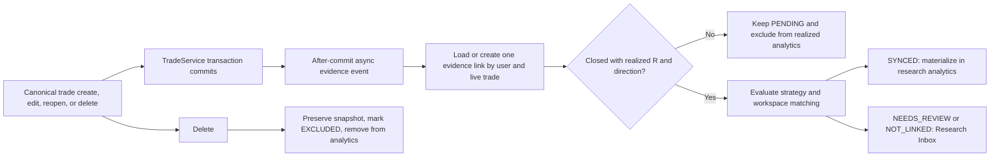

# Backtesting Evidence Engine implementation report

## 1. Existing Backtesting architecture summary

Before this work, `/backtesting` combined workspace discovery, workspace editing, research trades, filters, analytics, Edge Lenses, screenshots, notes, and every dialog in one 2,265-line page. The backend persisted independent workspace, manual/imported trade, screenshot, and Edge Lens records, but canonical live trades had no relationship to Backtesting. The detailed pre-change audit is in [backtesting-evidence-engine-architecture-audit.md](backtesting-evidence-engine-architecture-audit.md).

The candle-replay Backtest Lab embedded in Session Mode is a separate deterministic simulation feature. This redesign targets the `/backtesting` strategy-research module.

## 2. Main UX problems found

- Library discovery and deep workspace research competed on the same screen.
- The first workspace was silently selected, so users never had a clear library-level state.
- Manual and imported research rows could not be compared with real execution.
- Screenshot count had excessive visual weight despite not being an evidence-quality metric.
- Deep filters, actions, tabs, and research content were exposed at once, especially on mobile.
- Sample labels were count-only and did not account for unresolved evidence, negative expectancy, classification coverage, source diversity, or live/historical divergence.
- Static Backtesting copy, confirmations, errors, empty states, and accessibility labels were hardcoded in English.

## 3. New information architecture

`/backtesting` is now the Backtesting Library: summary metrics, shallow workspace search/filters, evidence-aware workspace cards, creation/import actions, and the Research Inbox.

`/backtesting/:workspaceId` is the focused research workspace. Its header owns matching configuration and high-value actions; detail is divided into Overview, Trades, Edge analysis, Evidence, and Notes. The desktop uses semantic tabs and the mobile layout uses a compact section selector.

## 4. New data model summary

The additive `backtest_evidence_links` table links one canonical live trade to at most one research evidence record per user. It stores:

- optional workspace relationship and immutable `live_trade_id` identity;
- source, sync, classification, and analytics-inclusion status;
- the last research snapshot of outcome, strategy, setup, instrument, direction, session, timeframe, risk, rule breaks, screenshot count, and notes;
- research-only classification JSON and exclusion/audit reason;
- synchronization and standard audit timestamps.

Canonical `trades` remain the source of truth. Existing `backtesting_trades`, screenshots, Edge Lenses, notes, and legacy counters remain unchanged. Live evidence is materialized into the existing analytics contract only when it is eligible and included.

## 5. Live-trade synchronization flow

Events run after the canonical write commits and on a bounded `backtestingEvidenceExecutor`. Errors are recorded as `ERROR` evidence and can be retried. Workspace edits trigger reconciliation of eligible closed trades.

## 6. Matching rules

Eligibility requires a closed canonical trade, `closedAt`, realized R, and LONG or SHORT direction. Research classifications are optional and never block synchronization.

Matching starts from the stable user-owned `strategy_id`:

- `EXACT_MATCH`: strategy, normalized symbol, optional normalized session, and optional normalized timeframe must match. Aliases such as `New York AM`/`NY_AM` and `5 minutes`/`5m` are normalized.
- `STRATEGY_MATCH`: every eligible closed trade for the linked strategy is accepted.
- `REVIEW_BEFORE_IMPORT`: a candidate link enters the inbox and remains outside analytics until approved.
- `DISABLED`: no new matches are created; already linked evidence remains intact.

One match synchronizes. Multiple automatic matches become `NEEDS_REVIEW` with `AMBIGUOUS_WORKSPACE_MATCH`. No match becomes `NOT_LINKED`. A unique `(user_id, live_trade_id)` constraint and update-in-place service make retries idempotent.

## 7. Migration summary

Flyway migration `V54__backtesting_live_evidence_engine.sql`:

- adds session, auto-import mode, description, research objective, structured research-note fields, and conclusion to workspaces;
- adds `LIVE` to the existing Backtesting trade-source constraint;
- creates `backtest_evidence_links` with ownership, foreign-key, uniqueness, source/status/classification/result checks, and inbox/workspace indexes;
- adds a matching index across user, workspace status, strategy, instrument, session, timeframe, and auto-import mode;
- preserves every pre-existing table and record; the only data repair normalizes null legacy trade sources to `MANUAL`.

The migration was applied successfully to local PostgreSQL after a clean build. Flyway validated 54 migrations and applied V43 through V54 on the local database.

## 8. Manual versus live analytics summary

Analytics now merge existing manual/imported research rows with included live evidence. Source comparisons show trade count, win rate, average R, expectancy, profit factor, average winner, average loser, maximum drawdown, and rule-break frequency. Overall metrics also include median R, maximum/current losing streak, and cumulative R.

The workspace UI states whether live expectancy confirms or contradicts the historical/manual baseline and always shows the live sample size. Open, reopened, excluded, ambiguous, unlinked, and failed evidence never affects realized analytics.

## 9. Research Inbox summary

The library-level inbox groups evidence needing a workspace, classification, ambiguous-match decision, synchronization retry, or exclusion review. Users can link a workspace, include or exclude evidence, retry synchronization, and open a structured classification editor. Classification supports market regime, higher-timeframe bias, liquidity/sweep, displacement, MSS, gap/fill, entry model, and research tags, with Partial or Complete status.

## 10. Evidence status methodology

Thresholds are configurable under `app.backtesting.evidence` and default to:

- fewer than 5 trades: Insufficient data;
- 5-9: Exploratory;
- 10-29: Early signal;
- 30-49: Developing edge;
- 50 or more: Validated evidence.

Regardless of count, unresolved inbox evidence, negative expectancy, or an absolute live/historical expectancy gap of at least 0.5R produces Needs review.

## 11. Confidence methodology

Confidence starts from sample size: 0 points below 10 trades, 1 at 10, 2 at 30, and 3 at 50. A second evidence source adds one point. More than 25% incomplete classifications, material live divergence, and negative expectancy each subtract one point. Scores map to Very low (0 or less), Low (1), Moderate (2-3), and High (4 or more).

This is deliberately an evidence-quality score, not a trading prediction.

## 12. Edge regression methodology

Regression compares the most recent 10 live trades with all non-live historical evidence. Fewer than 5 recent live trades or no historical baseline yields Insufficient live data. Expectancy delta at or below -0.5R is Deteriorating; below -0.2R is Watch; above +0.2R is Improving; otherwise it is Stable. The status and actual live sample are displayed together.

## 13. Chart improvements

Charts are lazy-loaded and share the active filtered dataset. The Overview contains accessible cumulative-R, peak-to-trough drawdown, and source-expectancy charts. Optional condition charts add session expectancy, direction results, and weekday expectancy. Every figure has a localized heading and plain-language description for non-visual interpretation.

## 14. Mobile improvements

- A compact section selector replaces overflowing tabs.
- Trades become readable cards instead of a compressed desktop table.
- Filters open in a full-screen mobile dialog.
- Add-trade and filter actions remain available in a sticky bottom action bar with content padding so they do not cover results.
- Workspace actions wrap into full-width controls, charts use responsive containers, dialogs use mobile full-screen mode, and screenshots use responsive previews.
- Verified without horizontal overflow at 320×568, 360×800, 390×844, 430×932, 768×1024, 1024×768, and 1440×900.

## 15. Accessibility improvements

The redesign adds semantic section navigation, localized accessible labels for filters, screenshot actions/drop zone, status explanations, and chart figures. Dialogs use Material UI focus trapping and labeled controls. Status is always communicated in text rather than color alone. Desktop tabs preserve native tab semantics; the mobile selector remains keyboard-operable. English and Romanian accessible names were inspected in the rendered DOM.

Automated browser QA confirmed a clean fresh-page runtime with zero console errors and zero missing-translation warnings. A React Router future-flag warning remains at framework level.

## 16. i18n structure

All research-module copy uses the existing `I18nProvider` and the `backtesting.*` namespace in `en.json` and `ro.json`. The namespace is divided into page, common, actions, library, workspace, autoImport, evidenceStatus, confidence, tabs, metrics, filters, trades, sources, results, sync/classification status, inbox, comparison, regression, charts, edge, evidence, notes, dialogs, pagination, empty, feedback, errors, accessibility, direction, and classification groups.

Dates, percentages, decimal values, and R values use locale-aware formatters. The translation coverage test asserts complete English/Romanian topology and a set of critical Backtesting keys.

## 17. Full list of new English translation keys

The complete 323-key English list is recorded under the English heading in [backtesting-i18n-key-manifest.md](backtesting-i18n-key-manifest.md). Values are in `frontend/src/i18n/en.json`.

## 18. Full list of new Romanian translation keys

The complete, topology-identical 323-key Romanian list is recorded under the Romanian heading in [backtesting-i18n-key-manifest.md](backtesting-i18n-key-manifest.md). Values are in `frontend/src/i18n/ro.json`.

## 19. Removed hardcoded strings

Hardcoded copy was removed from the redesigned research page and dialogs in these groups:

- library and workspace headings, subtitles, search, filters, source labels, evidence/confidence statuses, counts, and updated timestamps;
- create/edit/archive/import/manual-trade actions and every dialog title, confirmation, progress label, validation error, success message, and empty state;
- Overview metrics, source-comparison headers, live-confirmation/divergence messages, regression labels/descriptions, and chart titles/descriptions;
- Trades table/card labels, classification/sync labels, pagination, open-live-trade, edit, delete, include, exclude, retry, and classify actions;
- Edge findings, trade-count caveats, source mix, saved-lens actions, and low-sample warnings;
- screenshot evidence categories, drop-zone instructions, preview/open/delete labels, canonical live screenshot reuse, and no-evidence states;
- structured research notes, saving state, accessibility names, section navigation, and Romanian ARIA labels.

The exact replacement key set is the manifest linked above. The non-strict repository audit reports no missing EN/RO keys. The repository-wide strict scanner still finds 265 legacy hardcoded candidates, primarily in the separate Session Mode `BacktestLabWizard`; see Known limitations.

## 20. Modified files

Backend configuration, model, API, and services:

- `backend/src/main/java/com/tradevault/config/AsyncConfig.java`
- `backend/src/main/java/com/tradevault/config/BacktestingEvidenceProperties.java`
- `backend/src/main/java/com/tradevault/controller/BacktestingController.java`
- `backend/src/main/java/com/tradevault/domain/entity/BacktestingWorkspace.java`
- `backend/src/main/java/com/tradevault/domain/entity/BacktestEvidenceLink.java`
- `backend/src/main/java/com/tradevault/domain/enums/BacktestingTradeSource.java`
- `backend/src/main/java/com/tradevault/domain/enums/BacktestingAutoImportMode.java`
- `backend/src/main/java/com/tradevault/domain/enums/BacktestingClassificationStatus.java`
- `backend/src/main/java/com/tradevault/domain/enums/BacktestingEvidenceConfidence.java`
- `backend/src/main/java/com/tradevault/domain/enums/BacktestingEvidenceSource.java`
- `backend/src/main/java/com/tradevault/domain/enums/BacktestingEvidenceStatus.java`
- `backend/src/main/java/com/tradevault/domain/enums/BacktestingSyncStatus.java`
- Backtesting analytics, metric, summary, trade, workspace, evidence, and inbox DTOs under `backend/src/main/java/com/tradevault/dto/backtesting/`
- `backend/src/main/java/com/tradevault/repository/BacktestEvidenceLinkRepository.java`
- `backend/src/main/java/com/tradevault/repository/BacktestingWorkspaceRepository.java`
- `backend/src/main/java/com/tradevault/repository/TradeRepository.java`
- `backend/src/main/java/com/tradevault/service/BacktestingEvidenceAssessmentService.java`
- `backend/src/main/java/com/tradevault/service/BacktestingResearchService.java`
- `backend/src/main/java/com/tradevault/service/BacktestingService.java`
- `backend/src/main/java/com/tradevault/service/DatabaseResetService.java`
- `backend/src/main/java/com/tradevault/service/TradeService.java`
- event, listener, and sync service under `backend/src/main/java/com/tradevault/service/backtesting/`
- `backend/src/main/resources/db/migration/V54__backtesting_live_evidence_engine.sql`

Frontend and documentation:

- `frontend/src/App.tsx`
- `frontend/src/api/backtesting.ts`
- `frontend/src/pages/BacktestingPage.tsx`
- `frontend/src/features/backtesting/BacktestingCharts.tsx`
- `frontend/src/features/backtesting/BacktestingDialogs.tsx`
- `frontend/src/features/backtesting/research.ts`
- `frontend/src/i18n/en.json`
- `frontend/src/i18n/ro.json`
- `frontend/src/i18n/coverage.test.ts`
- `frontend/src/pages/BacktestingPage.test.tsx`
- the three Backtesting documents under `docs/`

Unrelated pre-existing worktree changes were preserved and are not part of this list.

## 21. Tests added or updated

- `LiveTradeEvidenceSyncServiceTest`: exact and normalized matching, strategy-only mode, review-before-import, ambiguity, no match, idempotent update, reopened trade, explicit exclusion, disabled-workspace preservation, and deleted snapshot.
- `BacktestingResearchServiceTest`: core metrics/sample thresholds plus backward-compatible legacy CSV and structured strategy/gap columns.
- `BacktestingServiceTest`: workspace compatibility and screenshot validation/storage behavior with the expanded service contract.
- `TradeServiceTest`: constructor/event-publisher integration while retaining all canonical trade-service coverage.
- `BacktestingPage.test.tsx`: library/source summary, route-separated workspace detail, manual-trade outcome consistency, and new API mocks.
- `i18n/coverage.test.ts`: English/Romanian topology plus required Evidence Engine keys.
- Live API QA: closed exact-match trade synchronized once as `LIVE`; editing its exit changed R from 2.0000 to 1.0000 while preserving the same evidence-link ID and count; deletion preserved the snapshot as `EXCLUDED`, outside analytics.

## 22. Commands run and results

- Focused backend: `mvn -q -Dtest=LiveTradeEvidenceSyncServiceTest,BacktestingResearchServiceTest,BacktestingServiceTest,TradeServiceTest test` — PASS, 49 tests, 0 failures/errors.
- Full backend: `mvn -q test` — 272 discovered, 0 assertion failures, 26 environment/baseline errors: 23 tests require unavailable Docker/Testcontainers and 3 unrelated existing null-fixture errors.
- Frontend: `npm run lint` — PASS with 0 errors and 22 pre-existing warnings outside the redesigned page.
- Frontend: `npm test -- --run src/pages/BacktestingPage.test.tsx src/i18n/coverage.test.ts` — PASS, 5 tests.
- Frontend: `npm run build` — PASS; includes TypeScript checking and Vite production build. Vite reports the existing large-entry-chunk advisory.
- i18n: `npm run i18n:audit` — PASS topology: 2,773 English and 2,773 Romanian keys, no missing keys.
- i18n strict: `npm run i18n:audit:strict` — blocked by 265 legacy candidates primarily in the separate `BacktestLabWizard`, not the redesigned `/backtesting` page.
- Migration/runtime: `mvn clean spring-boot:run` with local PostgreSQL — PASS; Flyway validated 54 migrations and applied V54.
- Browser/API QA — PASS: clean runtime console, no missing translations, EN/RO and light/dark switching, source-aware analytics, idempotent live create/edit/delete, full-screen mobile filters, sticky actions, and seven overflow-free viewports.

## 23. Known limitations

- The historical CSV path remains the compatible direct importer; a multi-step mapping, preview, and duplicate-resolution wizard is not included.
- The optional evidence timeline was not added. Current audit history is expressed through evidence status, reason, snapshot, and synchronization timestamps.
- Regression status is expectancy-centric. Drawdown, rule breaks, and streaks are visible but do not yet contribute to the regression classification.
- Linked live screenshots are reused read-only from canonical trade assets; Backtesting does not duplicate those files or edit their canonical metadata.
- The repository-wide strict i18n audit remains blocked by legacy Session Mode Backtest Lab copy outside this research-module refactor.
- Docker is unavailable locally, so repository integration tests could not run; migration behavior was instead verified against the existing local PostgreSQL instance and live REST flow.
- The focused page tests pass but Material UI interaction tests still emit non-failing React `act(...)` warnings.

## 24. Follow-up recommendations

1. Add a CSV mapping/preview/deduplication wizard on top of the preserved import endpoint.
2. Add an append-only evidence event timeline if review/audit history becomes a product requirement.
3. Extend regression scoring with drawdown, rule-break rate, losing streak, and configurable minimum samples.
4. Internationalize the separate Session Mode Backtest Lab and make the repository-wide strict i18n audit a CI gate.
5. Run the complete Testcontainers suite in Docker-enabled CI and add a dedicated migration fixture covering old workspaces, screenshots, notes, and Edge Lenses.
6. Resolve the existing React test `act(...)`, hook-dependency, and bundle-size warnings.

## 25. Screenshots and visual evidence

English, light, desktop (1440×900):

English, light, mobile (390×844):

Romanian, dark, desktop (1440×900):

